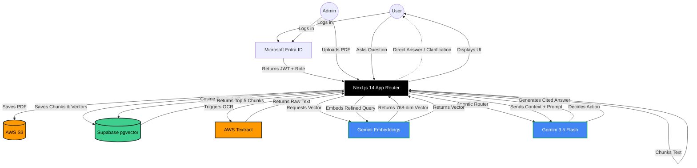

# Architecture Overview

Anchor is designed using a multi-cloud architecture, leveraging AWS for heavy data processing and storage, Google Cloud for AI inference, and Supabase for vector retrieval.

## System Diagram

## Core Pipelines

The application is split into two primary asynchronous pipelines:

### 1. Document Ingestion Pipeline
Handling large PDFs requires offloading OCR processing to prevent server timeouts.

1. **Upload:** PDFs are uploaded via the Next.js API and streamed directly to an AWS S3 bucket.
2. **OCR:** An asynchronous job is triggered in AWS Textract (`StartDocumentTextDetection`).
3. **Polling & Chunking:** A background process polls Textract for completion. Once finished, the raw text is parsed and split into ~500-character logical chunks.
4. **Vectorization:** Each chunk is sent to Google's `gemini-embedding-2` model, which generates a 768-dimension mathematical representation of the text.
5. **Storage:** The chunks and their corresponding vectors are saved into Supabase using the `pgvector` extension.

### 2. Retrieval-Augmented Generation (RAG) Pipeline
When a user asks a question, the system uses an agentic routing step before grounding the LLM using the ingested documents.

1. **Agentic Routing:** The user's text question is sent to Gemini to decide the best action. The router returns a structured JSON decision to either:
   - *Answer Directly* (for conversational meta-queries).
   - *Ask Clarification* (if the query is ambiguous).
   - *Search Document* (generates a refined search query for retrieval).
2. **Query Vectorization:** If searching, the refined query is converted into a 768-dimension vector using the Gemini embedding model.
3. **Semantic Search:** A PostgreSQL RPC function (`match_chunks`) executes a cosine-similarity search against the `pgvector` index, returning the 5 most mathematically similar document chunks.
4. **Prompt Construction:** The retrieved chunks are injected into a strict system prompt, instructing the LLM to answer the question using *only* the provided context.
5. **Generation & Loop Cap:** Google Gemini 3.5 Flash generates a natural language response containing bracketed citations. If the model determines it lacks sufficient information, the system loops back to the router for a second attempt (capped at a maximum of 2 iterations to prevent infinite re-search loops).

## Infrastructure
All infrastructure is declared as code using **Terraform**. A GitHub Actions CI/CD pipeline validates formatting, runs type checks, executes `terraform apply`, and automatically merges successful deployments into the `main` branch.
